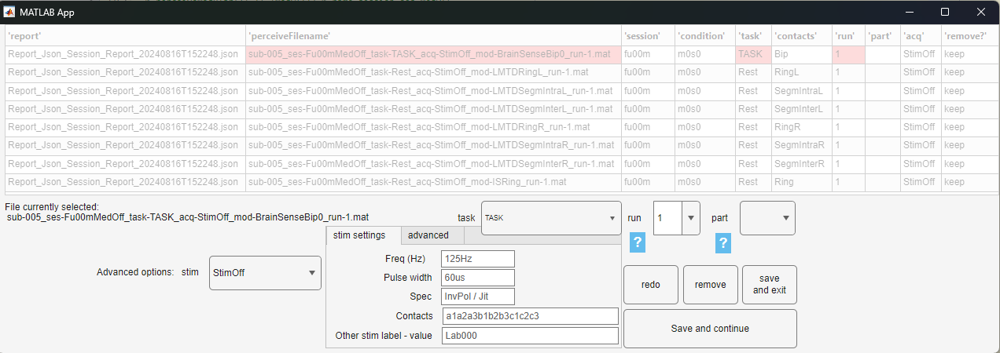
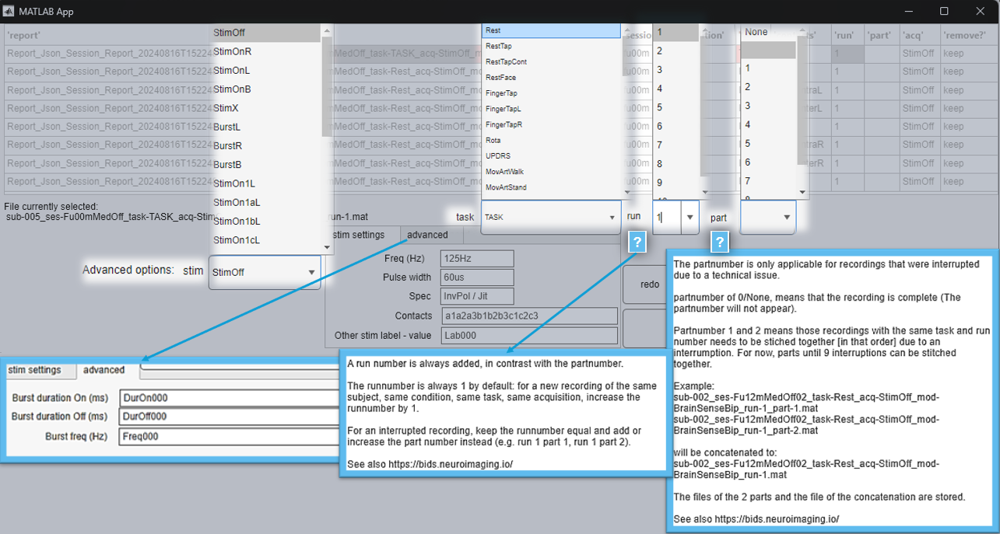

[](https://matlab.mathworks.com/)  [](https://github.com/neuromodulation/perceive/actions/workflows/main.yml) [](https://github.com/neuromodulation/perceive/issues?q=is%3Aissue+is%3Aopen+label%3Abug) 

[](https://app.codecov.io/gh/neuromodulation/perceive/tree/hackathonretune)   


# Perceive (MATLAB)

https://github.com/neuromodulation/perceive 
Founded by Wolf-Julian Neumann, Gerd Tinkhauser, Tomas Sieger
Maintainer Jojo Vanhoecke and colleagues from Unit for Movement Disorders, Charité

This is an open research tool that is not intended for clinical purposes. 

# INPUT

```matlab
perceive(files, sub, sesMedOffOn01, extended, gui, localsettings_name)
```
## files:
All input is optional, you can specify files as cell or character array
(e.g. `files = 'Report_Json_Session_Report_20200115T123657.json'`) 
if files isn't specified or remains empty, it will automatically include
all files in the current working directory
if no files in the current working directory are found, a you can choose
files via the MATLAB uigetdir window.

## sub:
SubjectID: you can specify a subject ID for each file in case you want to follow an IRB approved naming scheme for file export

e.g.
```matlab
perceive('Report_Json_Session_Report_20200115T123657.json',80) %creates sub-080
perceive('Report_Json_Session_Report_20200115T123657.json','080') %also creates sub-080
perceive('Report_Json_Session_Report_20200115T123657.json',80) %also creates sub-080
perceive('Report_Json_Session_Report_20200115T123657.json','Charite001') %creates sub-Charite001
perceive('Report_Json_Session_Report_20200115T123657.json','') %creates sub-2020110DGpi
perceive('Report_Json_Session_Report_20200115T123657.json') %creates sub-2020110DGpi
```
if unspecified or left empy, the subjectID will be created from
ImplantDate, first letter of disease type and target abbreviation (e.g. `sub-2020110DGpi`)

## ses:
session:
input e.g.
```matlab
['','MedOff','MedOn','MedDaily','MedOff01','MedOn01','MedOff02','MedOn02','MedOff03','MedOn03','MedOffOn01','MedOffOn02','MedOffOn03','MedOnPostOpIPG','MedOffPostOpIPG','Unknown', 'PostOp']
```
    

## extended:
'yes' or ''
If 'yes': saves all created files in between and in different formats
default: ''

## gui:
'yes' or ''
If 'yes': use gui for renaming and concatenation at end of perceive output
default: ''

## localsettings: (still in dev)
default is '', which is default

alternative: Charite Duesseldorf Wuerzburg or custom naming

names refer to the perceive\toolbox\config or any other file in your matlab folder which contains
```matlab
perceive_localsettings_default.json
perceive_localsettings_charite.json
perceive_localsettings_duesseldorf.json
perceive_localsettings_wuerzburg.json
perceive_localsettings_"custom name".json with custom name to be
```

filled in, together with custom settings. Needs to be in matlab path, needs start with perceive_localsettings_*json, but does not need to be in the perceive\toolbox\config folder
possible datafields from Medtronic Percept are
```matlab
["","BrainSenseLfp","BrainSenseSurvey","BrainSenseTimeDomain","CalibrationTests","DiagnosticData","EventSummary","Impedance","IndefiniteStreaming","LfpMontageTimeDomain","MostRecentInSessionSignalCheck","PatientEvents"])} ='';
```

# MAIN USE
```matlab
perceive(files, sub, sesMedOffOn01, extended, gui, localsettings_name)
```
# INPUT examples
```matlab
perceive() % run all files in current directory or if none open explorer to select file

perceive('Report_Json_Session_Report_20200115T123657.json') % run this file

perceive({'Report_Json_Session_Report_20200115T123657.json','Report_Json_Session_Report_20200115T123658.json'}) % run these files

perceive('',5) % name subject sub-005

perceive('','23') % name subject sub-023

perceive('','') % automatic name subject based on ImplantDate, first letter of disease type and target (e.g. sub-2020110DGpi)

perceive('','','MedOff') % name session ses-MedOff

perceive('','','PostOp') % name session ses-PostOp input e.g. ['','MedOff','MedOn','MedDaily','MedOff01','MedOn01','MedOff02','MedOn02','MedOff03','MedOn03','MedOffOn01','MedOffOn02','MedOffOn03','MedOnPostOpIPG','MedOffPostOpIPG','Unknown', 'PostOp']

perceive('','','') % automatic name session based on the session date

perceive('','','','yes') % gives an extensive output of chronic, calibration, lastsignalcheck, diagnostic, impedance and snapshot data

perceive('','','','') % regular output (default)

perceive('','','','', 'yes') %use gui for renaming and concatenation at end of perceive output

perceive('','','','', '') % no gui (default)

perceive('','','','', '', '') % localsettings (default)

perceive('','','','', '', 'default') % localsettings (default), refering to perceive_localsettings_default.json

perceive('','','','', '', 'charite') % localsettings charite-specific, refering to perceive_localsettings_charite.json

perceive('','','','', '', 'mylab') % localsettings your lab-specific, refering to perceive_localsettings_mylab.json
```
## applied example
```matlab
perceive('Report_Json_Session_Report_20200115T123657.json',25,'MedOff','yes', 'yes', 'perceive_localsettings_default.json') % combination of all above

```
# OUTPUT

The script generates BIDS bids.neuroimaging.io/ inspired subject and session folders with the
ieeg format specifier. 
All time series data are being exported as FieldTrip '.mat' files, as these require no additional dependencies for creation.
You can reformat with FieldTrip and SPM to MNE python and other formats (e.g. using fieldtrip2fiff([fullname '.fif'],data))

## Recording type output naming
Each of the FieldTrip data files correspond to a specific aspect of the Recording session:

LMTD = LFP Montage Time Domain - BrainSenseSurvey

IS = Indefinite Streaming - BrainSenseStreaming

CT = Calibration Testing - Calibration Tests

BSL = BrainSense LFP (2 Hz power average + stimulation settings)

BSTD = BrainSense Time Domain (250 Hz raw data corresponding to the BSL file)

BrainSenseBIp = BrainSense Bipolar, is merged combination of 2 BSTD with 1 BSL file.

EI = Electrode Identifier (as of DataVersion 1.2)

# Graphical User Interface (GUI)

## if GUi use is "yes"
specify to use the GUI
```matlab
perceive('Report_Json_Session_Report_20200115T123657.json',9,'','', 'yes') %use gui for renaming and concatenation at end of perceive output
```
the GUI allows for
* remove unwanted streams
* specifying task names
* specifying run number
* specifying acquisition, including stimulation options
* * advanced settings
* specifying part number
* * for concatenating streams with exactly the same name, apart from the part number
 





# Stream concatenation
## i.e. stitching 2 or more streams together due to interruption

The sampleinfo is used, which is a sample information based on the MSecTicks.
The sampleinfotime is now the sample number of the FirstPackageTime of the absolute time, computed from midnight, with a length of the sample frequency x the trial length (no further correction).
2 streams are concatenated by compute the sample difference between the last sample of the first part, and the first sample of the next part, (iteratively for multiple parts). This amount are the NaN values inserted when concatenating the streams.

## note on time-specificity

Because the FirstPacketDateTime is used, the resolution of that is 1 second, according to the Medtronic documentation.
The TicksInMSec have a resolution of 50ms, however, it is according to the ongoing information exchange with Medtronic as of now not possible to use the TicksInMSec of 2 streams to use these for concatenation.
According to the documenation TicksInMSec roll over at 2^16 Ticks unless it is an ongoing streaming. However, we were unable to find a satisfying solution for stream concatination based on our observations.
For higher time resolution and external synchronization, we refer to our colleagues with the Toolbox DBSSync [DOI: 10.21203/rs.3.rs-8228751/v1](https://doi.org/10.21203/rs.3.rs-8228751/v1)

## Manually increasing or decreasing the NaN interval

You can add or substract ms from this NaN interval by a custom number.
In order to concatenate 2 streams of the same modality within the same file, it is recommended to use the GUI.
Manual concatenation can be done of the perceive output matlab file of the same modality, by adding "part-" to the target file, and add a number. "_part-1" , "_part-2"
Ensure that the file that need to be concatenated have the exact same file name, apart from the part numbers.
i.e. first run perceive, concatenate the 2 or more streams over the GUI, just as normal.
Then go to the folder with the PARTS. The regular part will be saved already as normal, with a NAN interval based on the timestamps.
Modify this NAN interval by calling the parts (indicated by '_part-' at the end) and indicate your additional time in ms (or with negative time to shorten it).
```matlab
perceive_stitch_interruption_together(recording_basename, optional_time_addition_ms, save_file)
```
applied example
```matlab
perceive_stitch_interruption_together('sub-006_ses-Fu18mMedOff02_task-Rest_acq-StimOff_mod_BrainSenseBip_run-1_part-', 750, true) %add 250ms of additional NaNs to the default NaN-insertion in between streams of perceive output matlab file with name sub-006_ses-Fu18mMedOff02_task-Rest_acq-StimOff_mod_BrainSenseBip_run-1_part-, thereby concatenating sub-006_ses-Fu18mMedOff02_task-Rest_acq-StimOff_mod_BrainSenseBip_run-1_part-1 and sub-006_ses-Fu18mMedOff02_task-Rest_acq-StimOff_mod_BrainSenseBip_run-1_part-2

perceive_stitch_interruption_together('sub-006_ses-Fu18mMedOff02_task-Rest_acq-StimOff_mod_BrainSenseBip_run-1_part-', -145, true) %remove 145ms of NaNs from the the default NaN-insertion in between streams
```

# artefact rejection
Currently, there is in this perceive version no automatic artefact rejection (e.g. ECG cleaning); we refer to our colleagues [DOI: 10.21203/rs.3.rs-8228751/v1](https://doi.org/10.21203/rs.3.rs-8228751/v1)
and the Stam et al. 2023 Clinical Neurophysiology [DOI: 10.1016/j.clinph.2022.11.011](https://doi.org/10.1016/j.clinph.2022.11.011)

# package loss
Currently, there is no correction implemented for package loss, as it did not produce stable results for us.
Therefore, we refer to the documenation of Medtronic:
```matlab
TDtime = (TicksInMses(end)- (GlobalPacketSize(end)-1)/fsample) : 1/fsample : TicksInMses(end);
for m=length(GlobalPacketSize):-1:2
if TicksInMses(m)-TicksInMses(m-1) > (1 + GlobalPacketSize(m))/ fsample
Prev_packet = (TicksInMses(m-1)- (GlobalPacketSize(m-1)-1)/ fsample) : 1/fsample : TicksInMses(m-1);
TDtime = [Prev_packet,TDtime];
else
Prev_packet = (TDtime(1)- GlobalPacketSize(m-1)/ fsample): 1/fsample : TDtime(1) - 1/fsample;
TDtime = [Prev_packet,TDtime];
end
end
```

# contact
For feedback and remarks please contact Jojo Vanhoecke and their supervisor Prof. Dr. med. Wolf-Julian Neumann (julian.neumann@charite.de)
 

